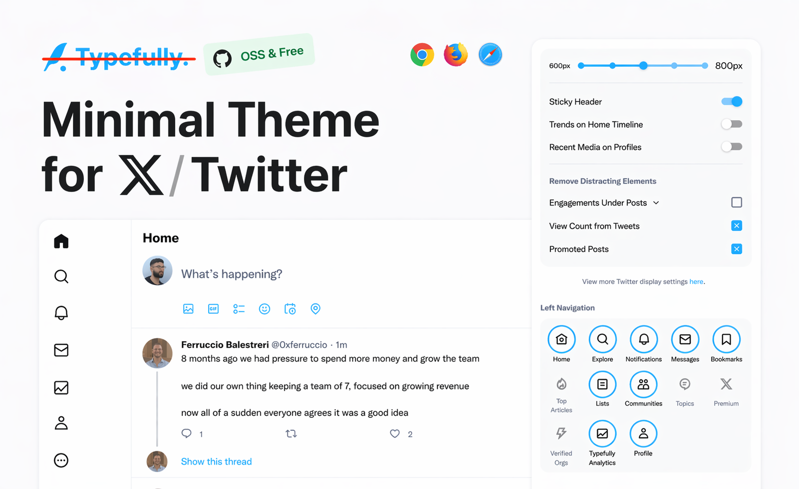

  

<h1 align="center">
  More Minimal Theme for X / Twitter 
  No <strike><a href="https://github.com/notkainoa/more-minimal-twitter">Typefully</a></strike> BS
</h1>

Available on [Chrome](https://chrome.google.com/webstore/detail/pobhoodpcipjmedfenaigbeloiidbflp) — or via [manual installation](./MANUAL_INSTALLATION.MD) for Firefox & Safari.

**More Minimal Theme for X / Twitter** is a browser extension originally made by [Thomas Wang](https://www.linkedin.com/in/xinganwang/), developed further by the [Typefully](https://typefully.com/?ref=minimal-twitter) team, and now forked + updated by [Kainoa Newton](https://github.com/notkainoa). To contribute / see development instructions, go to [CONTRIBUTING](./.github/CONTRIBUTING.md).

## Description

Refine and clean up the X/Twitter interface, and customize your experience:

- Default to the "Following" timeline
- Hide the sticky Timeline header
- Remove the new view counts
- Remove the distracting trends sidebar
- Customize your Timeline width
- Remove Timeline borders for a more minimal look
- Customize the left navigation
- Hide view count and vanity counts under tweets
- Remove promoted posts
- Remove "Who to Follow" and other suggestions
- Hide the Search Bar
- Hide the Tweet button
- Hide Grok AI elements
- And more...

## No typefully marketing/features

The biggest thing changed from [Typefully's version](https://github.com/typefully/minimal-twitter) is the removal of any marketing, features, or advertising for Typefully
